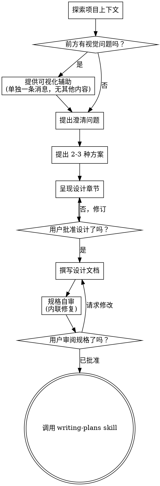

# 将构想头脑风暴为设计

通过自然、协作式的对话，帮助把想法打磨成完整的设计和规格。

先理解当前项目的上下文，然后一次只问一个问题来细化这个想法。一旦你理解了要构建什么，就呈现设计并获得用户批准。

<HARD-GATE>
在你呈现设计并且用户批准之前，不要调用任何实现类 skill，不要编写任何代码，不要为任何项目搭脚手架，也不要采取任何实现动作。无论项目看起来多么简单，这条规则都适用于每一个项目。
</HARD-GATE>

## 反模式：“这太简单了，不需要设计”

每个项目都要经过这个流程。待办清单、单函数工具、配置变更，所有这些都一样。“简单”项目往往正是那些未经检验的假设最容易造成浪费工作的地方。设计可以很短（对于真正简单的项目，几句话就够），但你必须把它呈现出来并获得批准。

## 检查清单

你必须为这些事项中的每一项创建任务，并按顺序完成：

1. **探索项目上下文** - 检查文件、文档、最近的提交
2. **提供可视化辅助**（如果主题会涉及视觉问题）- 这必须是一条单独的消息，不能和澄清问题合并。见下方“可视化辅助”一节。
3. **提出澄清问题** - 一次一个，理解目的/约束/成功标准
4. **提出 2-3 种方案** - 给出权衡以及你的推荐
5. **呈现设计** - 按其复杂度分段呈现，并在每一节之后获得用户批准
6. **撰写设计文档** - 保存到 `docs/superpowers/specs/YYYY-MM-DD-<topic>-design.md` 并提交
7. **规格自审** - 快速做内联检查，查占位符、矛盾、歧义、范围（见下文）
8. **用户审阅书面规格** - 在继续之前，请用户审阅规格文件
9. **转入实现** - 调用 `writing-plans` skill 创建实现计划

## 流程图

**终止状态是调用 `writing-plans`。** 不要调用 `frontend-design`、`mcp-builder` 或任何其他实现类 skill。在头脑风暴之后，你唯一可以调用的 skill 就是 `writing-plans`。

## 这个流程

**理解这个想法：**

- 先查看当前项目状态（文件、文档、最近的提交）
- 在提出详细问题之前，先评估范围：如果请求描述了多个相互独立的子系统（例如“构建一个包含聊天、文件存储、计费和分析的平台”），要立刻指出这一点。不要把问题花在细化一个实际上应先拆解的项目的细节上。
- 如果项目大到无法由单个规格覆盖，帮助用户把它拆成子项目：有哪些独立部分，它们如何关联，应该按什么顺序构建？然后按正常设计流程，只对第一个子项目做头脑风暴。每个子项目都要有自己独立的“规格 -> 计划 -> 实现”循环。
- 对于范围合适的项目，一次只问一个问题来细化这个想法
- 可能的话优先使用多选题，但开放式问题也可以
- 每条消息只问一个问题 - 如果某个主题需要更多探索，把它拆成多条问题
- 重点是理解：目的、约束、成功标准

**探索方案：**

- 提出 2-3 种不同方案，并说明权衡
- 以对话式方式呈现这些选项，同时给出你的推荐和理由
- 先给出你推荐的选项，并解释为什么

**呈现设计：**

- 一旦你认为自己理解了要构建什么，就呈现设计
- 每一节的篇幅按复杂度缩放：简单的情况几句话即可，复杂微妙的情况可以到 200-300 字
- 每一节之后都问一下，到目前为止看起来是否正确
- 覆盖：架构、组件、数据流、错误处理、测试
- 如果某些地方说不通，要准备好退回去澄清

**为隔离性和清晰度而设计：**

- 把系统拆成更小的单元，每个单元都只有一个清晰的目的，通过定义明确的接口通信，并且可以被独立理解和测试
- 对每个单元，你都应该能够回答：它做什么、如何使用它、它依赖什么？
- 一个人能否在不读内部实现的情况下理解一个单元做什么？你能否在不破坏使用方的情况下修改它的内部实现？如果不能，说明边界还需要继续打磨。
- 更小、边界清晰的单元也更便于你工作 - 你对一次能放进上下文里的代码推理得更好，而当文件聚焦时，你的改动也更可靠。一个文件变得很大，往往意味着它承担了过多职责。

**在现有代码库中工作：**

- 在提出变更之前，先探索当前结构。遵循既有模式。
- 如果现有代码存在会影响这项工作的缺陷（例如文件变得太大、边界不清、职责缠绕），把有针对性的改进纳入设计 - 就像优秀开发者在所接触的代码中会顺手做的那样。
- 不要提出无关的重构。保持聚焦，只做服务于当前目标的内容。

## 设计之后

**文档：**

- 将已经验证过的设计（规格）写入 `docs/superpowers/specs/YYYY-MM-DD-<topic>-design.md`
  - （如果用户对规格存放位置有偏好，则以用户偏好覆盖这个默认值）
- 如果可用，使用 `elements-of-style:writing-clearly-and-concisely` skill
- 将设计文档提交到 git

**规格自审：**
写完规格文档之后，用全新的眼光再看一遍：

1. **占位符扫描：** 是否有任何 “TBD”、“TODO”、未完成章节，或模糊的需求？把它们修掉。
2. **内部一致性：** 是否有任何章节彼此矛盾？架构是否与功能描述一致？
3. **范围检查：** 这个规格是否足够聚焦，适合一个实现计划，还是需要拆解？
4. **歧义检查：** 是否有任何需求可能被解读成两种不同方式？如果有，选定一种并明确写出来。

把发现的问题直接内联修掉。不需要重新审查 - 直接修完继续。

**用户审阅门槛：**
规格审阅循环通过后，请用户在继续之前审阅写好的规格：

> “规格已经写好并提交到 `<path>`。请审阅一下，如果你希望在我们开始展开实现计划之前做任何修改，请告诉我。”

等待用户响应。如果他们要求改动，就进行修改并重新跑一遍规格审阅循环。只有在用户批准之后才能继续。

**实现：**

- 调用 `writing-plans` skill 来创建详细的实现计划
- 不要调用任何其他 skill。下一步就是 `writing-plans`。

## 关键原则

- **一次一个问题** - 不要用多个问题把人压垮
- **优先多选题** - 在可能的情况下，它比开放式问题更容易回答
- **毫不留情地贯彻 YAGNI** - 从所有设计中移除不必要的功能
- **探索替代方案** - 在定案之前，始终提出 2-3 种方案
- **增量式验证** - 呈现设计，在继续之前获得批准
- **保持灵活** - 当某些地方说不通时，退回去澄清

## 可视化辅助

一个基于浏览器的辅助工具，用于在头脑风暴过程中展示模型图、图表和视觉选项。它是一个工具，不是一种模式。接受这个辅助功能，意味着当问题从视觉表达中受益时它可供使用；这并不意味着每个问题都要通过浏览器来处理。

**提供这个辅助功能：** 当你预期接下来的问题会涉及视觉内容（模型图、布局、图表）时，为征得同意提供一次这个选项：
> “我们正在处理的某些内容，如果我能在网页浏览器里展示给你看，可能会更容易解释。我可以在过程中整理模型图、图表、对比视图和其他视觉内容。这个功能还比较新，而且可能比较耗费 token。要试试吗？（需要打开本地 URL）”

**这个提议必须是一条单独的消息。** 不要把它和澄清问题、上下文总结或任何其他内容合并。该消息必须只包含上面的提议，不包含其他任何内容。继续之前先等待用户响应。如果他们拒绝，就继续进行纯文本头脑风暴。

**按问题决定：** 即使用户接受了，对于**每一个问题**，你也要决定使用浏览器还是终端。判断标准是：**用户通过看会不会比通过读更容易理解？**

- **使用浏览器** 处理本质上就是视觉内容的东西 - 模型图、线框图、布局对比、架构图、并排视觉设计
- **使用终端** 处理文本内容 - 需求问题、概念选择、权衡列表、A/B/C/D 文本选项、范围决策

一个关于 UI 主题的问题，并不会自动成为视觉问题。“这里的 personality 是什么意思？”是概念问题 - 用终端。“哪种 wizard 布局更好？”是视觉问题 - 用浏览器。

如果他们同意使用这个辅助功能，在继续之前先阅读详细指南：
`skills/brainstorming/visual-companion.md`
