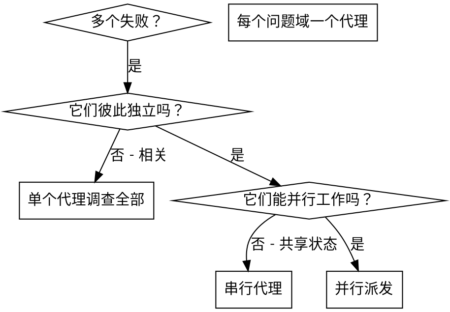

# 派发并行代理

## 概览

你把任务委派给拥有隔离上下文的专门代理。通过精确构造它们的指令和上下文，你可以确保它们保持专注并成功完成自己的任务。它们绝不应该继承你这个会话的上下文或历史 - 你要为它们构造出它们恰好所需的内容。这也保留了你自己的上下文，用于做协调工作。

当你面对多个互不相关的失败（不同的测试文件、不同的子系统、不同的 bug）时，按顺序逐个调查是在浪费时间。每一次调查都是独立的，因此可以并行进行。

**核心原则：** 每个独立的问题域派发一个代理。让它们并发工作。

## 何时使用



**在以下情况下使用：**
- 3 个以上测试文件失败，且根因不同
- 多个子系统彼此独立地损坏
- 每个问题都可以在不依赖其他问题上下文的情况下被理解
- 各项调查之间没有共享状态

**在以下情况下不要使用：**
- 失败是相关的（修一个可能会顺带修好其他）
- 需要理解完整的系统状态
- 代理之间会相互干扰

## 这个模式

### 1. 识别独立领域

按“哪里坏了”来分组失败：
- 文件 A 的测试：工具审批流程
- 文件 B 的测试：批处理完成行为
- 文件 C 的测试：中止功能

每个领域都是独立的 - 修复工具审批不会影响中止测试。

### 2. 创建聚焦的代理任务

每个代理拿到：
- **具体范围：** 一个测试文件或一个子系统
- **明确目标：** 让这些测试通过
- **约束：** 不要改动其他代码
- **预期输出：** 你发现了什么、修复了什么的总结

### 3. 并行派发

```typescript
// 在 Claude Code / AI 环境中
Task("修复 agent-tool-abort.test.ts 的失败")
Task("修复 batch-completion-behavior.test.ts 的失败")
Task("修复 tool-approval-race-conditions.test.ts 的失败")
// 三个任务并发运行
```

### 4. 审查并集成

当代理返回时：
- 阅读每一份总结
- 验证修复之间没有冲突
- 运行完整测试套件
- 集成全部改动

## 代理提示结构

好的代理提示具备：
1. **聚焦** - 一个清晰的问题域
2. **自包含** - 理解问题所需的全部上下文
3. **明确输出** - 代理应该返回什么？

```markdown
修复 src/agents/agent-tool-abort.test.ts 中这 3 个失败的测试：

1. "should abort tool with partial output capture" - 期望消息中包含 'interrupted at'
2. "should handle mixed completed and aborted tools" - 快速工具被中止了，而不是完成
3. "should properly track pendingToolCount" - 期望 3 个结果，但得到 0

这些是时序/竞争条件问题。你的任务：

1. 读取测试文件，理解每个测试在验证什么
2. 找出根因 - 是时序问题，还是实际的 bug？
3. 通过以下方式修复：
   - 用基于事件的等待替换随意设置的超时
   - 如果发现 bug，则修复中止实现中的 bug
   - 如果测试验证的是已变更行为，则调整测试预期

不要只是增加超时时间 - 要找出真正的问题。

返回：你发现了什么、修复了什么的总结。
```

## 常见错误

**错误：范围太大：** “把所有测试都修好” - 代理会迷失
**正确：具体明确：** “修复 `agent-tool-abort.test.ts`” - 范围聚焦

**错误：没有上下文：** “修复这个竞争条件” - 代理不知道在哪里
**正确：给出上下文：** 粘贴错误消息和测试名称

**错误：没有约束：** 代理可能把所有东西都重构了
**正确：给出约束：** “不要改动生产代码” 或 “只修测试”

**错误：输出模糊：** “修好它” - 你不知道改了什么
**正确：输出明确：** “返回根因和改动的总结”

## 何时不要使用

**相关失败：** 修复一个可能会修好其他 - 先一起调查
**需要完整上下文：** 理解问题需要看到整个系统
**探索式调试：** 你还不知道哪里坏了
**共享状态：** 代理之间会相互干扰（编辑同一文件、使用同一资源）

## 来自会话的真实示例

**场景：** 一次大型重构之后，3 个文件里有 6 个测试失败

**失败：**
- `agent-tool-abort.test.ts`：3 个失败（时序问题）
- `batch-completion-behavior.test.ts`：2 个失败（工具没有执行）
- `tool-approval-race-conditions.test.ts`：1 个失败（执行计数 = 0）

**决策：** 这是独立的问题域 - 中止逻辑、批处理完成逻辑和竞争条件彼此分离

**派发：**
```
代理 1 -> 修复 agent-tool-abort.test.ts
代理 2 -> 修复 batch-completion-behavior.test.ts
代理 3 -> 修复 tool-approval-race-conditions.test.ts
```

**结果：**
- 代理 1：用基于事件的等待替换了超时
- 代理 2：修复了事件结构 bug（`threadId` 放错位置）
- 代理 3：增加了等待，以便异步工具执行完成

**集成：** 所有修复都彼此独立，没有冲突，完整套件变绿

**节省的时间：** 3 个问题并行解决，而不是串行解决

## 关键收益

1. **并行化** - 多项调查同时进行
2. **聚焦** - 每个代理范围都很窄，需要追踪的上下文更少
3. **独立性** - 代理彼此不干扰
4. **速度** - 用解决 1 个问题的时间解决 3 个问题

## 验证

代理返回之后：
1. **审查每一份总结** - 理解改了什么
2. **检查冲突** - 代理是否编辑了同一段代码？
3. **运行完整套件** - 验证所有修复可以协同工作
4. **抽样检查** - 代理可能会犯系统性错误

## 真实世界影响

来自一次调试会话（2025-10-03）：
- 3 个文件里有 6 个失败
- 3 个代理被并行派发
- 所有调查都并发完成
- 所有修复都成功集成
- 代理改动之间零冲突
