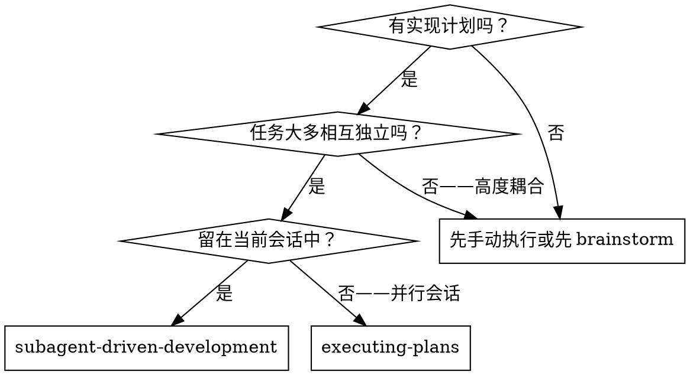
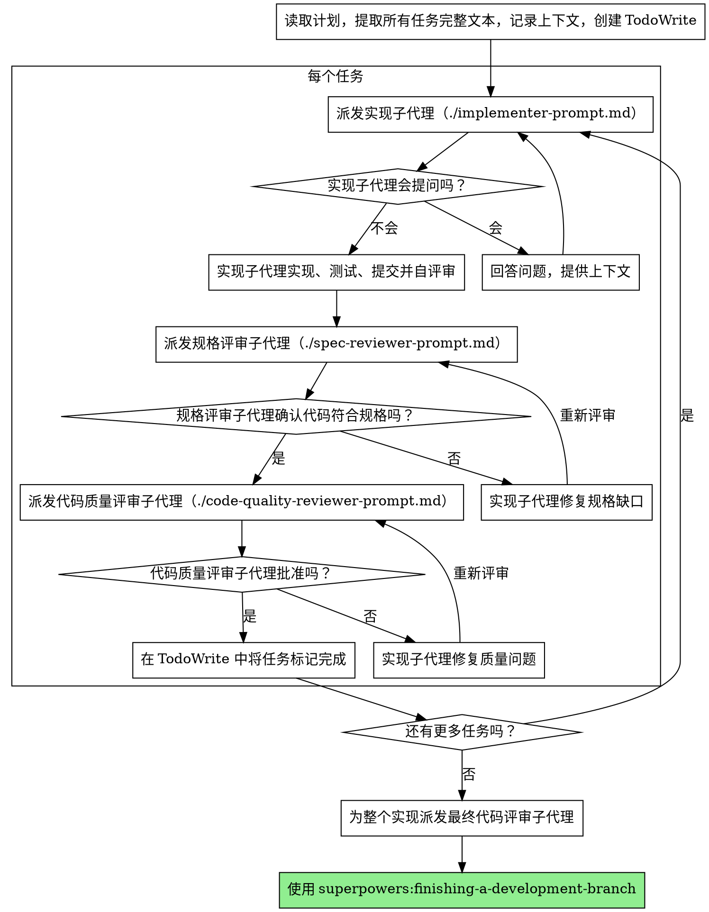

# 子代理驱动开发

通过为每个任务派发全新的子代理来执行计划，并在每个任务后进行两阶段评审：先做规格符合性评审，再做代码质量评审。

**为什么使用子代理：** 你把任务委派给拥有隔离上下文的专用代理。通过精确构造它们的指令和上下文，你能确保它们保持专注并成功完成任务。它们不应继承你这个会话的上下文或历史——你只提供它们确切需要的内容。这也能保留你自己的上下文，用于协调工作。

**核心原则：** 每个任务使用全新子代理 + 两阶段评审（规格先于质量） = 高质量、快速迭代

## 何时使用



**对比 Executing Plans（并行会话）：**
- 同一会话内（无需上下文切换）
- 每个任务使用全新的子代理（无上下文污染）
- 每个任务后两阶段评审：先规格符合性，再代码质量
- 迭代更快（任务之间不需要人工介入）

## 流程



## 模型选择

为节省成本并提高速度，针对每个角色使用足以处理任务的最弱模型。

**机械性实现任务**（孤立函数、规格清晰、1-2 个文件）：使用快速、廉价的模型。只要计划写得足够具体，大多数实现任务都是机械性的。

**集成和判断类任务**（多文件协调、模式匹配、调试）：使用标准模型。

**架构、设计和评审任务：** 使用当前可用能力最强的模型。

**任务复杂度信号：**
- 涉及 1-2 个文件且规格完整 → 廉价模型
- 涉及多个文件且存在集成顾虑 → 标准模型
- 需要设计判断或对整个代码库有广泛理解 → 最强模型

## 处理实现者状态

实现子代理会报告四种状态之一。要分别正确处理：

**DONE：** 进入规格符合性评审。

**DONE_WITH_CONCERNS：** 实现者完成了工作，但标出了疑虑。继续之前先阅读这些疑虑。如果这些疑虑涉及正确性或范围，先处理再评审。如果只是观察类问题（例如“这个文件越来越大了”），记下来并继续评审。

**NEEDS_CONTEXT：** 实现者需要尚未提供的信息。补充缺失的上下文并重新派发。

**BLOCKED：** 实现者无法完成任务。评估阻塞原因：
1. 如果是上下文问题，补充更多上下文，并用同一模型重新派发
2. 如果任务需要更多推理能力，换用更强的模型重新派发
3. 如果任务过大，把它拆成更小的部分
4. 如果计划本身有问题，升级给人类

**永远不要**忽略升级信号，也不要在不做任何改变的情况下强迫同一个模型重试。如果实现者说卡住了，就必须改变某些条件。

## Prompt 模板

- `./implementer-prompt.md` - 派发实现子代理
- `./spec-reviewer-prompt.md` - 派发规格符合性评审子代理
- `./code-quality-reviewer-prompt.md` - 派发代码质量评审子代理

## 示例工作流

```
你：我正在使用子代理驱动开发来执行这个计划。

[读一次计划文件：docs/superpowers/plans/feature-plan.md]
[提取全部 5 个任务的完整文本与上下文]
[创建包含全部任务的 TodoWrite]

任务 1：安装 hook 的脚本

[获取任务 1 的文本与上下文（已提取）]
[将完整任务文本 + 上下文派发给实现子代理]

实现者：“开始之前问一下——这个 hook 应该安装在用户级还是系统级？”

你：“用户级（~/.config/superpowers/hooks/）”

实现者：“明白。现在开始实现……”
[稍后] 实现者：
  - 实现了 install-hook 命令
  - 添加了测试，5/5 通过
  - 自评审：发现漏了 --force 标志，已补上
  - 已提交

[派发规格符合性评审]
规格评审者：✓ 符合规格——所有要求都满足，没有多做内容

[获取 git SHA，派发代码质量评审]
代码评审者：优点：测试覆盖好，代码干净。问题：无。批准。

[将任务 1 标记完成]

任务 2：恢复模式

[获取任务 2 的文本与上下文（已提取）]
[将完整任务文本 + 上下文派发给实现子代理]

实现者：[没有问题，直接开始]
实现者：
  - 增加了 verify/repair 模式
  - 8/8 测试通过
  - 自评审：一切正常
  - 已提交

[派发规格符合性评审]
规格评审者：✗ 问题：
  - 缺失：进度报告（规格要求“每处理 100 项报告一次”）
  - 额外：加入了 --json 标志（未被要求）

[实现者修复问题]
实现者：移除了 --json 标志，并加入进度报告

[规格评审者再次评审]
规格评审者：✓ 现在符合规格

[派发代码质量评审]
代码评审者：优点：很扎实。问题（重要）：魔法数字（100）

[实现者修复]
实现者：提取了 PROGRESS_INTERVAL 常量

[代码评审者再次评审]
代码评审者：✓ 批准

[将任务 2 标记完成]

...

[所有任务完成后]
[派发最终代码评审者]
最终评审者：所有要求都已满足，可以合并

完成！
```

## 优势

**对比手动执行：**
- 子代理会自然遵循 TDD
- 每个任务都是新上下文（不易混淆）
- 可安全并行（子代理互不干扰）
- 子代理可以提问（在开始前和进行中都可以）

**对比 Executing Plans：**
- 同一会话内（无需交接）
- 持续推进（无需等待）
- 评审检查点自动化

**效率提升：**
- 没有文件阅读开销（控制者直接提供完整文本）
- 控制者精确筛选所需上下文
- 子代理一开始就拿到完整信息
- 问题会在开始工作前暴露出来（而不是做完后）

**质量门槛：**
- 自评审会在交接前发现问题
- 两阶段评审：先规格符合性，再代码质量
- 评审循环确保修复真的有效
- 规格符合性防止做多或做少
- 代码质量确保实现本身构建良好

**成本：**
- 需要更多子代理调用（每个任务：实现者 + 2 个评审者）
- 控制者需要做更多准备工作（提前提取所有任务）
- 评审循环会增加迭代次数
- 但能更早发现问题（比后期调试更便宜）

## 危险信号

**永远不要：**
- 在未得到用户明确同意的情况下在 `main/master` 分支上开始实现
- 跳过评审（规格符合性评审或代码质量评审任一都不行）
- 带着未修复的问题继续推进
- 并行派发多个实现子代理（会冲突）
- 让子代理自己去读计划文件（要直接提供完整文本）
- 跳过场景上下文说明（子代理需要理解任务在整体中的位置）
- 忽略子代理的问题（必须先回答，再让它继续）
- 对规格符合性接受“差不多就行”（规格评审者发现问题 = 还没完成）
- 跳过评审循环（评审者发现问题 = 实现者修复 = 再评审）
- 让实现者的自评审替代真正评审（两者都需要）
- **在规格符合性评审通过前就开始代码质量评审**（顺序错了）
- 任何一个评审还有未解决问题时就切到下一个任务

**如果子代理提问：**
- 清晰、完整地回答
- 必要时补充额外上下文
- 不要催它仓促开始实现

**如果评审者发现问题：**
- 由实现者（同一个子代理）来修复
- 由评审者重新评审
- 重复直到通过
- 不要跳过复评

**如果子代理没能完成任务：**
- 派发一个修复子代理，并给出具体指令
- 不要自己手动修（会污染上下文）

## 集成

**必需的工作流 skills：**
- **superpowers:using-git-worktrees** - 必需：开始前建立隔离工作区
- **superpowers:writing-plans** - 创建由此 skill 执行的计划
- **superpowers:requesting-code-review** - 给评审子代理使用的代码评审模板
- **superpowers:finishing-a-development-branch** - 所有任务完成后收尾开发

**子代理应使用：**
- **superpowers:test-driven-development** - 子代理在每个任务中遵循 TDD

**替代工作流：**
- **superpowers:executing-plans** - 若要使用并行会话而不是同会话执行，则使用它
