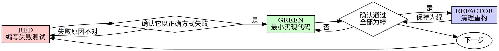

# 测试驱动开发（TDD）

## 概述

先写测试。看着它失败。再写最少代码让它通过。

**核心原则：** 如果你没有亲眼看见测试失败，你就不知道这个测试测的是不是正确的东西。

**违背规则的字面要求，就是违背规则的精神。**

## 何时采用

**始终适用：**
- 新功能
- Bug 修复
- 重构
- 行为变更

**例外（先问你的人类搭档）：**
- 一次性原型
- 生成代码
- 配置文件

如果你在想“这次就跳过 TDD 吧”，停下。这就是合理化。

## 铁律

```
没有先失败的测试，就不要写生产代码
```

先写了代码再写测试？删掉它。重新开始。

**没有例外：**
- 不要把它留作“参考”
- 不要在写测试时“顺便改造”它
- 不要看它
- 删除就是真的删除

从测试重新开始实现。就这样。

## 红-绿-重构



### RED - 编写失败测试

写一个最小测试，展示应该发生什么。

????
```typescript
test('重试失败的操作 3 次', async () => {
  let attempts = 0;
  const operation = () => {
    attempts++;
    if (attempts < 3) throw new Error('fail');
    return 'success';
  };

  const result = await retryOperation(operation);

  expect(result).toBe('success');
  expect(attempts).toBe(3);
});
```
名字清晰，测试真实行为，只测一件事
??????

????
```typescript
test('retry works', async () => {
  const mock = jest.fn()
    .mockRejectedValueOnce(new Error())
    .mockRejectedValueOnce(new Error())
    .mockResolvedValueOnce('success');
  await retryOperation(mock);
  expect(mock).toHaveBeenCalledTimes(3);
});
```
名字模糊，测的是 mock 不是代码
??????

**要求：**
- 只测一种行为
- 名字清晰
- 使用真实代码（除非无法避免，否则不要用 mocks）

### 验证 RED - 亲眼看它失败

**强制要求。永远不要跳过。**

```bash
npm test path/to/test.test.ts
```

确认：
- 测试失败（而不是报错）
- 失败信息符合预期
- 失败是因为功能缺失（而不是拼写错误）

**测试通过了？** 说明你测的是已有行为。修测试。

**测试报错了？** 修错误，重新运行，直到它以正确方式失败。

### GREEN - 最小代码

写出通过测试所需的最简单代码。

????
```typescript
async function retryOperation<T>(fn: () => Promise<T>): Promise<T> {
  for (let i = 0; i < 3; i++) {
    try {
      return await fn();
    } catch (e) {
      if (i === 2) throw e;
    }
  }
  throw new Error('unreachable');
}
```
只写刚好足够通过的内容
??????

????
```typescript
async function retryOperation<T>(
  fn: () => Promise<T>,
  options?: {
    maxRetries?: number;
    backoff?: 'linear' | 'exponential';
    onRetry?: (attempt: number) => void;
  }
): Promise<T> {
  // YAGNI
}
```
过度设计
??????

不要额外加功能，不要重构其他代码，也不要做超出测试要求的“优化”。

### 验证 GREEN - 亲眼看它通过

**强制要求。**

```bash
npm test path/to/test.test.ts
```

确认：
- 测试通过
- 其他测试依然通过
- 输出干净（没有错误、没有警告）

**测试失败？** 修代码，不要改测试。

**其他测试失败？** 立刻修。

### REFACTOR - 清理重构

只在变绿之后进行：
- 去重
- 改善命名
- 提取辅助函数

保持测试为绿。不要增加行为。

### 重复

为下一个功能写下一个失败测试。

## 好测试

| 质量 | 好 | 坏 |
|---------|------|-----|
| **最小** | 只测一件事。名字里有 “and”？拆开。 | `test('验证 email、domain 和 whitespace')` |
| **清晰** | 名字描述行为 | `test('test1')` |
| **体现意图** | 展示期望的 API | 模糊代码本应做什么 |

## 为什么顺序很重要

**“我之后再写测试来验证它能不能工作”**

代码写完之后再补测试，测试会立刻通过。立刻通过本身什么都证明不了：
- 可能测错东西
- 可能测的是实现，而不是行为
- 可能漏掉你忘记的边界情况
- 你从未看见它真正抓住这个 bug

测试先行会强迫你先看到测试失败，从而证明它真的在测试某些东西。

**“我已经手工测过所有边界情况了”**

手工测试是临时性的。你以为自己测全了，但：
- 没有你到底测了什么的记录
- 代码一改，不能重跑
- 压力下很容易漏掉情况
- “我试的时候能跑” ≠ 全面验证

自动化测试是系统性的。它们每次都会以同样的方式运行。

**“删掉已经做了 X 小时的工作很浪费”**

这是沉没成本谬误。时间已经花掉了。你现在的选择是：
- 删掉并按 TDD 重写（再花 X 小时，高信心）
- 保留它并事后补测试（30 分钟，低信心，大概率有 bug）

真正的“浪费”是保留一段你无法信任的代码。没有真实测试的“能跑代码”就是技术债。

**“TDD 太教条了，灵活点才算务实”**

TDD 本身就是务实：
- 在提交前发现 bug（比事后调试更快）
- 防止回归（测试马上能抓住破坏）
- 记录行为（测试展示代码该怎么用）
- 支持重构（放心改，测试兜底）

所谓“务实”的捷径 = 去生产环境里调试 = 更慢。

**“事后补测试也能达到同样目标——重在精神，不在仪式”**

不对。事后测试回答的是“这段代码现在做了什么？”；测试先行回答的是“这段代码本应做什么？”

事后测试会被你的实现所偏置。你测的是你已经写出来的东西，而不是需求本身。你验证的是你还记得的边界情况，而不是你在实现前发现出来的边界情况。

测试先行会逼你在实现前发现边界情况。事后测试只是验证你有没有把所有东西都记住（你记不住）。

事后补 30 分钟测试 ≠ TDD。你得到了覆盖率，失去了证明测试有效的能力。

## 常见合理化借口

| 借口 | 现实 |
|--------|---------|
| “太简单了，不用测” | 简单代码也会坏。测试只要 30 秒。 |
| “我之后再测” | 立刻通过的测试什么都证明不了。 |
| “事后测试也能达到同样目标” | 事后测试 = “它现在做什么？” 测试先行 = “它应该做什么？” |
| “我已经手动测过了” | 临时性 ≠ 系统性。没有记录，不能重跑。 |
| “删掉 X 小时很浪费” | 这是沉没成本谬误。保留未经验证的代码是技术债。 |
| “先留着做参考，再先写测试” | 你一定会去改造它。那就是事后测试。删除就是真的删除。 |
| “我得先探索一下” | 可以。探索代码扔掉，正式开始时仍然用 TDD。 |
| “这个测试太难写，说明我还没想清楚” | 听测试的。难测 = 难用。 |
| “TDD 会拖慢我” | TDD 比调试更快。务实 = 测试先行。 |
| “手动测试更快” | 手动测试无法证明边界情况。每次改动你都得重测。 |
| “现有代码本来就没测试” | 现在轮到你改进它。给已有代码补测试。 |

## 危险信号——停下并重新开始

- 先写代码后写测试
- 在实现之后写测试
- 测试一上来就通过
- 你说不清测试为什么失败
- 测试被留到“后面再补”
- 在合理化“就这一次”
- “我已经手工测过了”
- “事后测试也能达到同样目的”
- “重在精神，不在仪式”
- “先留作参考”或“改造现有代码”
- “已经花了 X 小时，删掉太浪费”
- “TDD 太教条了，我这是务实”
- “这次不一样，因为……”

**以上全部意味着：删掉代码。用 TDD 重新开始。**

## 示例：修复 bug

**Bug：** 允许空 email 提交

**RED**
```typescript
test('拒绝空 email', async () => {
  const result = await submitForm({ email: '' });
  expect(result.error).toBe('Email required');
});
```

**验证 RED**
```bash
$ npm test
FAIL: expected 'Email required', got undefined
```

**GREEN**
```typescript
function submitForm(data: FormData) {
  if (!data.email?.trim()) {
    return { error: 'Email required' };
  }
  // ...
}
```

**验证 GREEN**
```bash
$ npm test
PASS
```

**REFACTOR**
如果有需要，提取多个字段共用的校验逻辑。

## 验证清单

在标记工作完成之前：

- [ ] 每个新函数/方法都有测试
- [ ] 在实现前亲眼看过每个测试失败
- [ ] 每个测试都因预期原因失败（功能缺失，而非拼写错误）
- [ ] 为让每个测试通过只写了最少代码
- [ ] 所有测试都通过
- [ ] 输出干净（没有错误、没有警告）
- [ ] 测试使用真实代码（只有无法避免时才用 mocks）
- [ ] 覆盖了边界情况和错误情况

无法全部勾上？那你就跳过了 TDD。重新开始。

## 卡住时怎么办

| 问题 | 解决办法 |
|---------|----------|
| 不知道怎么测试 | 先写出你希望拥有的 API。先写断言。向你的人类搭档求助。 |
| 测试太复杂 | 设计太复杂。简化接口。 |
| 什么都得 mock | 代码耦合太紧。使用依赖注入。 |
| 测试初始化过于庞大 | 提取辅助函数。仍然复杂？简化设计。 |

## 与调试的结合

发现 bug 了？先写能复现它的失败测试。然后遵循 TDD 循环。测试既能证明修复有效，也能防止回归。

修 bug 时绝不要没有测试。

## 测试反模式

当你添加 mocks 或测试工具时，阅读 `@testing-anti-patterns.md`，避免常见陷阱：
- 测的是 mock 行为，而不是实际行为
- 为了测试给生产类加测试专用方法
- 在不理解依赖的情况下就开始 mock

## 最终规则

```
生产代码 → 测试已存在并且先失败过
否则 → 这就不是 TDD
```

未经你的人类搭档许可，没有任何例外。
