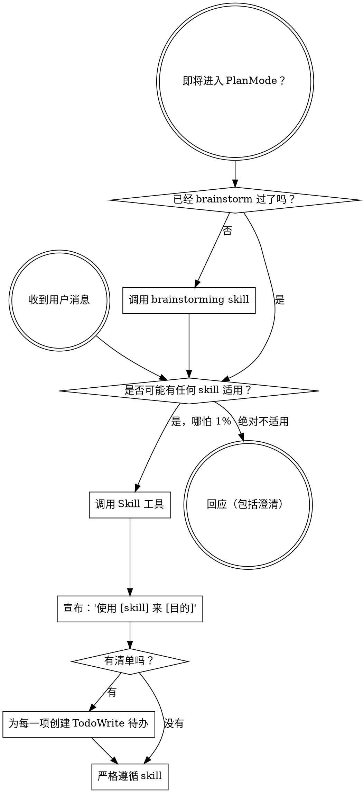

????????
如果你是作为子代理被派发来执行某个具体任务的，跳过这个 skill。
??????????

??????
如果你觉得某个 skill 有哪怕 1% 的可能适用于你正在做的事，你都绝对必须调用这个 skill。

如果某个 SKILL 适用于你的任务，你没有选择。你必须使用它。

这不可协商。这不是可选项。你不能靠自我合理化绕过去。
????????

## 指令优先级

Superpowers skills 会覆盖默认系统提示词的行为，但**用户指令始终优先**：

1. **用户的明确指令**（`CLAUDE.md ??`、`GEMINI.md ??`、`AGENTS.md ??`、直接请求）——最高优先级
2. **Superpowers skills**——在与默认系统行为冲突时覆盖它
3. **默认系统提示词**——最低优先级

如果 `CLAUDE.md ??`、`GEMINI.md ??` 或 `AGENTS.md ??` 说“不要用 TDD”，而某个 skill 说“始终使用 TDD”，遵循用户的指令。用户拥有控制权。

## 如何访问技能

**在 Claude Code 中：** 使用 `Skill` 工具。当你调用一个 skill 时，它的内容会被加载并展示给你——直接照着做。永远不要用 Read 工具去读 skill 文件。

**在 Copilot CLI 中：** 使用 `skill` 工具。Skills 会从已安装插件中自动发现。`skill` 工具的工作方式与 Claude Code 的 `Skill` 工具相同。

**在 Gemini CLI 中：** Skills 通过 `activate_skill` 工具激活。Gemini 会在会话开始时加载 skill 元数据，并在需要时按需激活完整内容。

**在其他环境中：** 查看你所在平台关于 skills 如何加载的文档。

## 平台适配说明

Skills 使用的是 Claude Code 的工具名。非 CC 平台：请查看 `references/copilot-tools.md`（Copilot CLI）、`references/codex-tools.md`（Codex）中的等价工具。Gemini CLI 用户会通过 `GEMINI.md ??` 自动加载工具映射。

# 使用 Skills

## 规则

**在任何回应或行动之前，调用相关或被请求的 skills。** 只要有哪怕 1% 的可能某个 skill 适用，就应该调用该 skill 进行检查。如果调用后发现这个 skill 对当前情况并不适用，那你可以不继续使用它。

## 危险信号

这些想法一出现就意味着要停下——你正在自我合理化：

| 想法 | 现实 |
|---------|---------|
| “这只是个简单问题” | 问题也是任务。检查是否有适用的 skill。 |
| “我得先多了解一点上下文” | skill 检查必须发生在澄清问题之前。 |
| “我先探索一下代码库” | skills 会告诉你该如何探索。先检查。 |
| “我可以先快速看看 git/文件” | 文件缺乏对话上下文。先检查 skills。 |
| “我先收集点信息” | skills 会告诉你该如何收集信息。 |
| “这不需要正式的 skill” | 只要存在 skill，就用它。 |
| “我记得这个 skill” | skills 会演进。读当前版本。 |
| “这不算任务” | 只要有行动，就是任务。检查 skills。 |
| “这个 skill 用起来太重了” | 简单的事也会变复杂。用它。 |
| “我先把这一件事做了再说” | 在做任何事之前先检查。 |
| “这样感觉很高效” | 无纪律的行动会浪费时间。skills 就是用来防止这种情况。 |
| “我知道那是什么意思” | 知道概念 ≠ 使用 skill。调用它。 |

## Skill 优先级

当多个 skills 可能适用时，按这个顺序：

1. **先用流程型 skills**（brainstorming、debugging）——它们决定如何处理任务
2. **再用实现型 skills**（frontend-design、mcp-builder）——它们指导执行

“我们来构建 X” → 先用 brainstorming，再用实现型 skills。  
“修这个 bug” → 先用 debugging，再用领域特定的 skills。

## Skill 类型

**刚性**（TDD、debugging）：必须原样遵循。不要靠“适配”绕开纪律。

**灵活**（patterns）：按上下文调整原则。

具体是哪种，由 skill 自己说明。

## 用户指令

指令说明的是做什么，不是怎么做。“加上 X”或“修复 Y”并不意味着可以跳过工作流。
