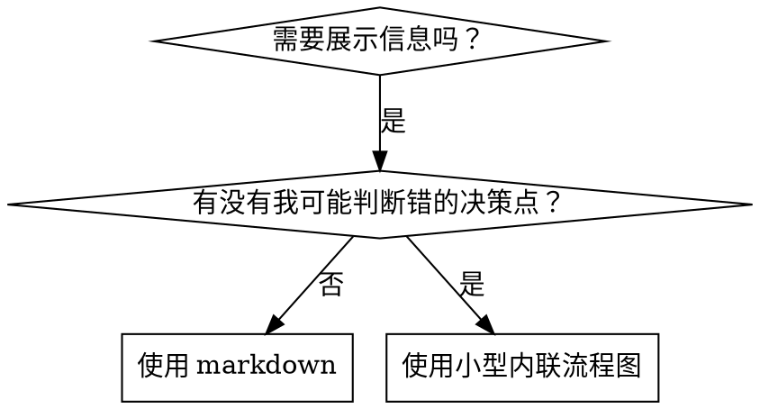

# 编写 Skills

## 概述

**编写 skills 就是把测试驱动开发应用到流程文档上。**

**个人 skills 存放在代理特定目录中（Claude Code 为 `~/.claude/skills`，Codex 为 `~/.agents/skills/`）**

你先写测试用例（带压力场景的子代理测试），看着它们失败（基线行为），再写 skill（文档），再看测试通过（代理遵守），最后重构（堵上漏洞）。

**核心原则：** 如果你没有先看过代理在没有这个 skill 时会失败，你就不知道这个 skill 教的是不是正确的东西。

**必需背景：** 在使用本 skill 之前，你**必须**理解 `superpowers:test-driven-development`。那个 skill 定义了最基础的 RED-GREEN-REFACTOR 循环。本 skill 是把 TDD 适配到文档上。

**官方指导：** 关于 Anthropic 官方的 skill 编写最佳实践，请查看 `anthropic-best-practices.md`。该文档提供了额外的模式和指南，可与本 skill 中以 TDD 为中心的方法互补。

## 什么是技能？

**skill** 是经过验证的技术、模式或工具的参考指南。skills 帮助未来的 Claude 实例找到并应用有效的方法。

**Skills 是：** 可复用技术、模式、工具、参考指南

**Skills 不是：** 讲述你曾经如何解决过某个问题的故事

## Skills 的 TDD 映射

| TDD 概念 | Skill 创建中的对应物 |
|-------------|----------------|
| **测试用例** | 带压力场景的子代理 |
| **生产代码** | Skill 文档（`SKILL.md`） |
| **测试失败（RED）** | 没有 skill 时代理违反规则（基线） |
| **测试通过（GREEN）** | 有 skill 时代理遵守规则 |
| **重构** | 在保持合规的同时堵上漏洞 |
| **先写测试** | 在写 skill 之前先运行基线场景 |
| **看着它失败** | 记录代理使用的确切合理化说辞 |
| **最小代码** | 写一个只解决这些具体违规的 skill |
| **看着它通过** | 验证代理现在会遵守 |
| **重构循环** | 找到新的合理化 → 堵住 → 再验证 |

整个 skill 创建过程都遵循 RED-GREEN-REFACTOR。

## 何时创建 Skill

**以下情况应创建：**
- 这个技术对你来说并不直觉显然
- 你以后还会在多个项目中反复参考它
- 这个模式适用范围广（而非项目特定）
- 其他人也会从中受益

**以下情况不要创建：**
- 一次性解决方案
- 别处已经充分文档化的标准实践
- 项目特定约定（写到 `CLAUDE.md 配置` 里）
- 机械性约束（如果能用正则 / 校验强制执行，就自动化——把文档留给需要判断的问题）

## Skill 类型

### 技法
有明确步骤可执行的具体方法（`condition-based-waiting`、`root-cause-tracing`）

### 模式
处理问题的思维方式（`flatten-with-flags`、`test-invariants`）

### 参考
API 文档、语法指南、工具说明（office docs）

## 目录结构


```
skills/
  skill-name/
    SKILL.md              # 主参考文档（必需）
    supporting-file.*     # 仅在需要时添加
```

**扁平命名空间**——所有 skills 都放在同一个可搜索命名空间中

**单独拆文件适用于：**
1. **重型参考资料**（100+ 行）——API 文档、完整语法说明
2. **可复用工具**——脚本、工具、模板

**应保持内联的内容：**
- 原则和概念
- 代码模式（少于 50 行）
- 其他所有内容

## `SKILL.md` 结构
**前置元数据（YAML）说明：**
- 两个必填字段：`name` 和 `description`（所有支持字段见 [agentskills.io/specification](https://agentskills.io/specification)）
- 总长度最多 1024 个字符
- `name`：只使用字母、数字和连字符（不要用括号、特殊字符）
- `description`：用第三人称，只描述**何时使用**（不要描述它做什么）
  - 以 “Use when...” 开头，把重点放在触发条件上
  - 包含具体症状、场景和上下文
  - **绝不要在 description 里总结这个 skill 的流程或工作流**（原因见 CSO 一节）
  - 尽量控制在 500 字符以内

```markdown
---
name: Skill-Name-With-Hyphens
description: Use when [specific triggering conditions and symptoms]
---

# Skill Name

## Overview
What is this? Core principle in 1-2 sentences.

## When to Use
[Small inline flowchart IF decision non-obvious]

Bullet list with SYMPTOMS and use cases
When NOT to use

## Core Pattern (for techniques/patterns)
Before/after code comparison

## Quick Reference
Table or bullets for scanning common operations

## Implementation
Inline code for simple patterns
Link to file for heavy reference or reusable tools

## Common Mistakes
What goes wrong + fixes

## Real-World Impact (optional)
Concrete results
```


## Claude 搜索优化（CSO）

**发现性至关重要：** 未来的 Claude 得能找到你的 skill

### 1. 丰富的 Description 字段

**目的：** Claude 会读取 description，决定面对某个任务时该加载哪些 skills。它必须回答这个问题：“我现在应该读这个 skill 吗？”

**格式：** 以 “Use when...” 开头，把重点放在触发条件上

**关键要求：Description = 何时使用，而不是 Skill 做什么**

description 只应描述触发条件。不要在 description 里总结这个 skill 的流程或工作流。

**为什么这很重要：** 测试表明，如果 description 总结了 skill 的工作流，Claude 可能会只照着 description 做，而不去读完整 skill 内容。曾有一个 description 写了 “code review between tasks”，结果 Claude 只做了**一次**评审，尽管 skill 的流程图明明清楚展示了两次评审（规格符合性，然后代码质量）。

当 description 被改成只写 “Use when executing implementation plans with independent tasks”（不总结工作流）后，Claude 就会正确读取流程图，并遵循两阶段评审流程。

**陷阱在于：** 会总结工作流的 description 会给 Claude 制造一条捷径。skill 正文会变成它直接跳过的文档。

```yaml
# ✗ BAD: 总结了工作流——Claude 可能照这个做，而不是读 skill
description: Use when executing plans - dispatches subagent per task with code review between tasks

# ✗ BAD: 过程细节过多
description: Use for TDD - write test first, watch it fail, write minimal code, refactor

# ✓ GOOD: 只写触发条件，不总结工作流
description: Use when executing implementation plans with independent tasks in the current session

# ✓ GOOD: 只写触发条件
description: Use when implementing any feature or bugfix, before writing implementation code
```

**内容要求：**
- 使用具体的触发条件、症状和场景，表明这个 skill 何时适用
- 描述的是**问题**（竞态条件、行为不一致），而不是**语言特定症状**（`setTimeout`、`sleep`）
- 除非 skill 本身是技术特定的，否则保持触发条件与技术无关
- 如果 skill 是技术特定的，在触发条件里明确写出来
- 使用第三人称（因为它会被注入系统提示词）
- **绝不要总结 skill 的流程或工作流**

```yaml
# ✗ BAD: 过于抽象、模糊，没有说明何时使用
description: For async testing

# ✗ BAD: 第一人称
description: I can help you with async tests when they're flaky

# ✗ BAD: 提到了某种技术，但 skill 本身并不特定于它
description: Use when tests use setTimeout/sleep and are flaky

# ✓ GOOD: 以 "Use when" 开头，描述问题，不总结工作流
description: Use when tests have race conditions, timing dependencies, or pass/fail inconsistently

# ✓ GOOD: 技术特定 skill，且显式说明触发条件
description: Use when using React Router and handling authentication redirects
```

### 2. 关键词覆盖

使用 Claude 会搜索的词：
- 错误信息：“Hook timed out”、“ENOTEMPTY”、“race condition”
- 症状：“flaky”、“hanging”、“zombie”、“pollution”
- 同义词：“timeout/hang/freeze”、“cleanup/teardown/afterEach”
- 工具：真实命令、库名、文件类型

### 3. 描述性命名

**使用主动语态、动词优先：**
- ✓ `creating-skills`，而不是 `skill-creation`
- ✓ `condition-based-waiting`，而不是 `async-test-helpers`

### 4. Token 效率（关键）

**问题：** getting-started 和高频引用的 skills 会被加载进**每一场**对话。每个 token 都很重要。

**目标字数：**
- getting-started 工作流：每个 <150 词
- 高频加载的 skills：总计 <200 词
- 其他 skills：<500 词（仍需保持简洁）

**技巧：**

**把细节移到工具帮助中：**
```bash
# ✗ BAD: 在 SKILL.md 里记录所有参数
search-conversations supports --text, --both, --after DATE, --before DATE, --limit N

# ✓ GOOD: 引用 --help
search-conversations supports multiple modes and filters. Run --help for details.
```

**使用交叉引用：**
```markdown
# ✗ BAD: 重复工作流细节
When searching, dispatch subagent with template...
[20 lines of repeated instructions]

# ✓ GOOD: 引用其他 skill
Always use subagents (50-100x context savings). REQUIRED: Use [other-skill-name] for workflow.
```

**压缩示例：**
```markdown
# ✗ BAD: 冗长示例（42 词）
your human partner: "How did we handle authentication errors in React Router before?"
You: I'll search past conversations for React Router authentication patterns.
[Dispatch subagent with search query: "React Router authentication error handling 401"]

# ✓ GOOD: 精简示例（20 词）
Partner: "How did we handle auth errors in React Router?"
You: Searching...
[Dispatch subagent → synthesis]
```

**消除冗余：**
- 不要重复其他交叉引用 skill 里已有的内容
- 不要解释命令本身已经很明显的东西
- 不要为同一种模式提供多个例子

**验证：**
```bash
wc -w skills/path/SKILL.md
# getting-started 工作流：目标每个 <150
# 其他高频技能：总计目标 <200
```

**按你做的事或核心洞见命名：**
- ✓ `condition-based-waiting` > `async-test-helpers`
- ✓ `using-skills`，而不是 `skill-usage`
- ✓ `flatten-with-flags` > `data-structure-refactoring`
- ✓ `root-cause-tracing` > `debugging-techniques`

**动名词（-ing）很适合表达流程：**
- `creating-skills`、`testing-skills`、`debugging-with-logs`
- 它们是主动的，描述的是你正在执行的动作

### 4. 交叉引用其他 Skills

**当你写的文档中需要引用其他 skills 时：**

只使用 skill 名称，并带显式需求标记：
- ✓ 好：`**REQUIRED SUB-SKILL:** Use superpowers:test-driven-development`
- ✓ 好：`**REQUIRED BACKGROUND:** You MUST understand superpowers:systematic-debugging`
- ✗ 坏：`See skills/testing/test-driven-development`（不清楚是否必需）
- ✗ 坏：`@skills/testing/test-driven-development/SKILL.md`（会强制加载，浪费上下文）

**为什么不能用 @ 链接：** `@` 语法会立刻强制加载文件，在你真正需要之前就消耗 200k+ 上下文。

## 流程图使用



**仅在以下场景使用流程图：**
- 不明显的决策点
- 你可能过早停下来的流程循环
- “什么时候用 A，什么时候用 B” 这类决策

**以下场景绝不要用流程图：**
- 参考资料 → 用表格、列表
- 代码示例 → 用 markdown 代码块
- 线性说明 → 用编号列表
- 没有语义意义的标签（`step1`、`helper2`）

查看 `@graphviz-conventions.dot` 了解 graphviz 样式规则。

**给你的人类搭档做可视化：** 使用当前目录下的 `render-graphs.js`，把 skill 中的流程图渲染成 SVG：
```bash
./render-graphs.js ../some-skill           # 每张图单独输出
./render-graphs.js ../some-skill --combine # 所有图合并到一张 SVG
```

## 代码示例

**一个极好的例子，胜过很多平庸的例子**

选择最相关的语言：
- 测试技术 → TypeScript/JavaScript
- 系统调试 → Shell/Python
- 数据处理 → Python

**好例子应当：**
- 完整且可运行
- 有注释解释 WHY
- 来自真实场景
- 清晰展示模式
- 可以直接改造使用（而不是通用模板）

**不要：**
- 用 5+ 种语言分别实现
- 创建留空待填模板
- 写生造的例子

你很擅长移植——一个优秀例子就足够了。

## 文件组织

### 自包含 Skill
```
defense-in-depth/
  SKILL.md    # 所有内容都内联
```
适用场景：所有内容都装得下，不需要重型参考资料

### 带可复用工具的 Skill
```
condition-based-waiting/
  SKILL.md    # 概述 + 模式
  example.ts  # 可改造使用的工作辅助代码
```
适用场景：工具是可复用代码，而不只是叙述

### 带重型参考资料的 Skill
```
pptx/
  SKILL.md       # 概述 + 工作流
  pptxgenjs.md   # 600 行 API 参考
  ooxml.md       # 500 行 XML 结构
  scripts/       # 可执行工具
```
适用场景：参考资料大到不适合内联

## 铁律（与 TDD 相同）

```
没有先失败的测试，就不要创建 skill
```

这条规则适用于**新 skill**，也适用于**对现有 skill 的编辑**。

先写 skill 再测试？删掉它。重新开始。  
先改 skill 不测试？同样违规。

**没有例外：**
- 不是“简单增补”也不例外
- 不是“只是加个章节”也不例外
- 不是“文档更新”也不例外
- 不要把未经测试的改动留作“参考”
- 不要一边跑测试一边“顺便改造”
- 删除就是真的删除

**必需背景：** `superpowers:test-driven-development` skill 已经解释了为什么这很重要。相同原则同样适用于文档。

## 测试所有 Skill 类型

不同类型的 skill 需要不同测试方法：

### 强制纪律型 Skills（规则 / 要求）

**例子：** TDD、verification-before-completion、designing-before-coding

**测试方式：**
- 学术型问题：它们理解这些规则吗？
- 压力场景：它们在压力下还会遵守吗？
- 多重压力组合：时间压力 + 沉没成本 + 疲惫
- 识别合理化，并加入显式反制

**成功标准：** 代理在最大压力下仍遵守规则

### 技法型 Skills（操作指南）

**例子：** `condition-based-waiting`、`root-cause-tracing`、`defensive-programming`

**测试方式：**
- 应用场景：它们能否正确应用这项技术？
- 变化场景：它们能否处理边界情况？
- 信息缺失测试：说明里是否存在缺口？

**成功标准：** 代理能将该技术成功应用到新场景

### 模式型 Skills（心智模型）

**例子：** `reducing-complexity`、信息隐藏相关概念

**测试方式：**
- 识别场景：它们能识别出什么时候适用这个模式吗？
- 应用场景：它们能使用这个心智模型吗？
- 反例场景：它们知道什么时候**不该**用吗？

**成功标准：** 代理能正确识别何时、如何使用该模式

### 参考型 Skills（文档 / API）

**例子：** API 文档、命令参考、库指南

**测试方式：**
- 检索场景：它们能找到正确的信息吗？
- 应用场景：它们能正确使用找到的信息吗？
- 缺口测试：常见用例是否被覆盖？

**成功标准：** 代理能找到并正确应用参考信息

## 跳过测试的常见合理化借口

| 借口 | 现实 |
|--------|---------|
| “这个 skill 已经很清楚了” | 对你清楚 ≠ 对其他代理清楚。测试它。 |
| “它只是参考文档” | 参考文档也可能有缺口或表述不清。测试检索效果。 |
| “测试太小题大做了” | 未经测试的 skill 总有问题。永远如此。15 分钟测试能省下数小时。 |
| “如果出了问题我再测” | 出问题 = 代理已经不会用这个 skill 了。部署前就要测。 |
| “测试太麻烦了” | 测试远没有在生产环境里调试坏 skill 那么麻烦。 |
| “我很确定它已经足够好了” | 过度自信保证会出问题。照样要测。 |
| “做学术式审阅就够了” | 阅读 ≠ 使用。要测应用场景。 |
| “没时间测试” | 部署未测试的 skill，后面修起来会更浪费时间。 |

**这些全都意味着：部署前先测试。没有例外。**

## 让 Skills 对合理化具备免疫力

强制纪律的 skills（比如 TDD）必须能够抵抗合理化。代理很聪明，在压力下它们会寻找漏洞。

**心理学说明：** 理解说服技巧为何有效，有助于你系统化应用它们。关于权威、承诺、稀缺、社会认同和共同体原则的研究基础，请查看 `persuasion-principles.md`（Cialdini, 2021；Meincke et al., 2025）。

### 显式堵住每一个漏洞

不要只是陈述规则——要明确禁止特定绕过方式：

**坏例子：**
```markdown
Write code before test? Delete it.
```
这条太弱了。

**更好的例子：**
```markdown
Write code before test? Delete it. Start over.

**No exceptions:**
- Don't keep it as "reference"
- Don't "adapt" it while writing tests
- Don't look at it
- Delete means delete
```
它堵住了更多漏洞。

### 处理“精神 vs 字面”论证

尽早加入这条基础原则：

```markdown
**Violating the letter of the rules is violating the spirit of the rules.**
```

这能切断整类“我是在遵循精神”的合理化说辞。

### 构建合理化表格

把基线测试中出现的合理化说辞都记录下来（见下面 Testing 一节）。代理说出的每个借口都要进表：

```markdown
| Excuse | Reality |
|--------|---------|
| "Too simple to test" | Simple code breaks. Test takes 30 seconds. |
| "I'll test after" | Tests passing immediately prove nothing. |
| "Tests after achieve same goals" | Tests-after = "what does this do?" Tests-first = "what should this do?" |
```

### 创建危险信号清单

让代理能够在合理化时进行自检：

```markdown
## Red Flags - STOP and Start Over

- Code before test
- "I already manually tested it"
- "Tests after achieve the same purpose"
- "It's about spirit not ritual"
- "This is different because..."

**All of these mean: Delete code. Start over with TDD.**
```

### 为违规症状更新 CSO

在 description 中加入“你正要违反这条规则时会出现的症状”：

```yaml
description: use when implementing any feature or bugfix, before writing implementation code
```

## Skills 的 RED-GREEN-REFACTOR

遵循 TDD 循环：

### RED：写失败测试（基线）

在**没有** skill 的情况下，用子代理运行压力场景。记录精确行为：
- 它们做了哪些选择？
- 它们用了哪些合理化说辞（逐字记录）？
- 哪些压力触发了违规？

这就是“看着测试失败”——你必须先看到代理在自然状态下会怎么做，才能去写 skill。

### GREEN：写最小 Skill

编写只针对这些具体合理化说辞的 skill。不要为了假设性情况添加额外内容。

用**有** skill 的情况下运行同样场景。代理现在应当遵守规则。

### REFACTOR：堵住漏洞

代理又找到了新的合理化方式？加入显式反制。重复测试，直到牢不可破。

**测试方法论：** 查看 `@testing-skills-with-subagents.md` 了解完整测试方法：
- 如何编写压力场景
- 压力类型（时间、沉没成本、权威、疲惫）
- 如何系统性堵漏洞
- 元测试技巧

## 反模式

### ✗ 叙事型示例
“在 2025-10-03 的某次会话里，我们发现空的 projectDir 会导致……”
**为什么不好：** 太具体，不可复用

### ✗ 多语言稀释
`example-js.js`、`example-py.py`、`example-go.go`
**为什么不好：** 质量平庸，维护负担大

### ✗ 在流程图里写代码
```dot
step1 [label="import fs"];
step2 [label="read file"];
```
**为什么不好：** 无法复制粘贴，也难读

### ✗ 泛化标签
`helper1`、`helper2`、`step3`、`pattern4`
**为什么不好：** 标签应当有语义含义

## 停下：在进入下一个 Skill 之前

**写完任何一个 skill 后，你都必须停下，并完成部署流程。**

**不要：**
- 为了省事批量创建多个 skill，却不逐个测试
- 在当前 skill 尚未验证前就进入下一个
- 因为“批处理更高效”而跳过测试

**下面的部署清单，对每一个 skill 都是强制要求。**

部署未测试的 skill = 部署未测试的代码。这违反质量标准。

## Skill 创建清单（TDD 适配版）

**重要：对下面每一个清单项，都要用 TodoWrite 创建待办。**

**RED 阶段 - 写失败测试：**
- [ ] 创建压力场景（纪律型 skill 需要 3+ 组合压力）
- [ ] 在没有 skill 的情况下运行场景——逐字记录基线行为
- [ ] 识别合理化 / 失败模式

**GREEN 阶段 - 写最小 Skill：**
- [ ] 名称只用字母、数字、连字符（没有括号 / 特殊字符）
- [ ] YAML frontmatter 包含必需的 `name` 和 `description` 字段（总计最多 1024 字符；见 [spec](https://agentskills.io/specification)）
- [ ] Description 以 “Use when...” 开头，并包含具体触发条件 / 症状
- [ ] Description 使用第三人称
- [ ] 全文包含便于搜索的关键词（错误、症状、工具）
- [ ] 有清晰的概述和核心原则
- [ ] 针对 RED 阶段识别出的具体基线失败点
- [ ] 代码要么内联，要么链接到单独文件
- [ ] 只给一个优秀示例（不是多语言示例）
- [ ] 在有 skill 的情况下运行场景——验证代理现在会遵守

**REFACTOR 阶段 - 堵住漏洞：**
- [ ] 识别测试中出现的**新**合理化说辞
- [ ] 加入显式反制（如果是纪律型 skill）
- [ ] 根据全部测试迭代构建合理化表格
- [ ] 创建危险信号清单
- [ ] 重测，直到牢不可破

**质量检查：**
- [ ] 仅在决策不明显时使用小型流程图
- [ ] 有速查表
- [ ] 有常见错误章节
- [ ] 没有叙事型讲故事
- [ ] 仅在需要工具或重型参考资料时才拆 supporting files

**部署：**
- [ ] 把 skill 提交到 git 并 push 到你的 fork（如果已配置）
- [ ] 如果具有广泛价值，考虑通过 PR 回馈

## 发现工作流

未来的 Claude 会这样找到你的 skill：

1. **遇到问题**（“tests are flaky”）
3. **找到 SKILL**（description 匹配）
4. **浏览概述**（这个相关吗？）
5. **阅读模式**（速查表）
6. **加载示例**（只有在开始实现时）

**要针对这个流程做优化**——把可搜索词尽早、频繁地放进去。

## 最终结论

**创建 skills，就是把 TDD 用到流程文档上。**

同样的铁律：没有先失败的测试，就不要有 skill。  
同样的循环：RED（基线）→ GREEN（写 skill）→ REFACTOR（堵漏洞）。  
同样的收益：更高质量、更少意外、更牢靠的结果。

如果你对代码遵循 TDD，那对 skills 也要一样。只是把同样的纪律应用到文档而已。
